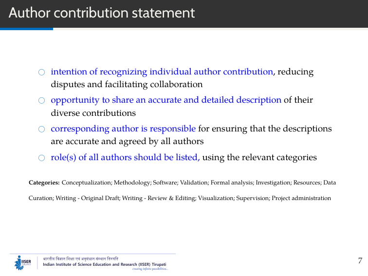
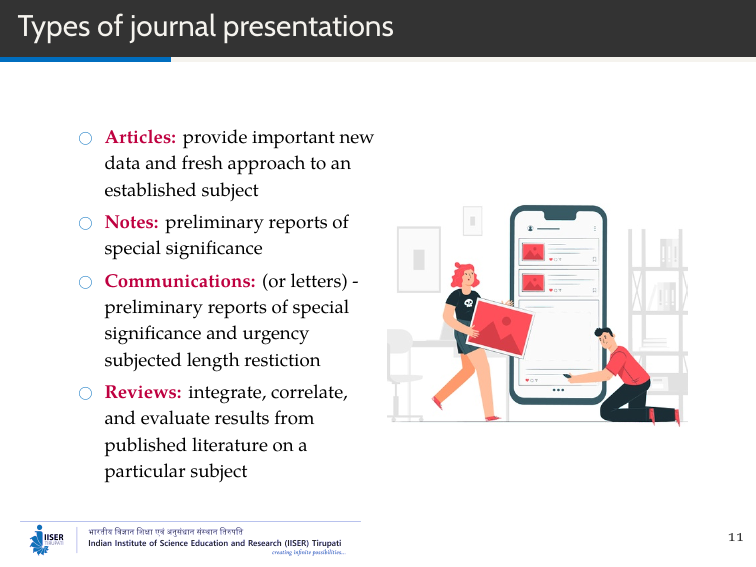
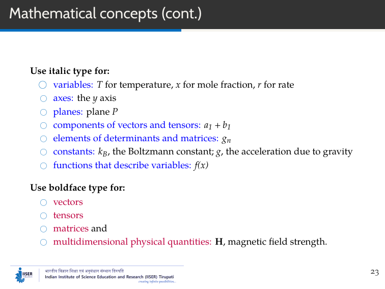
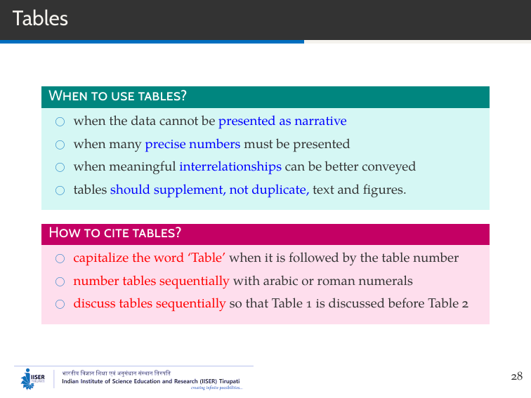
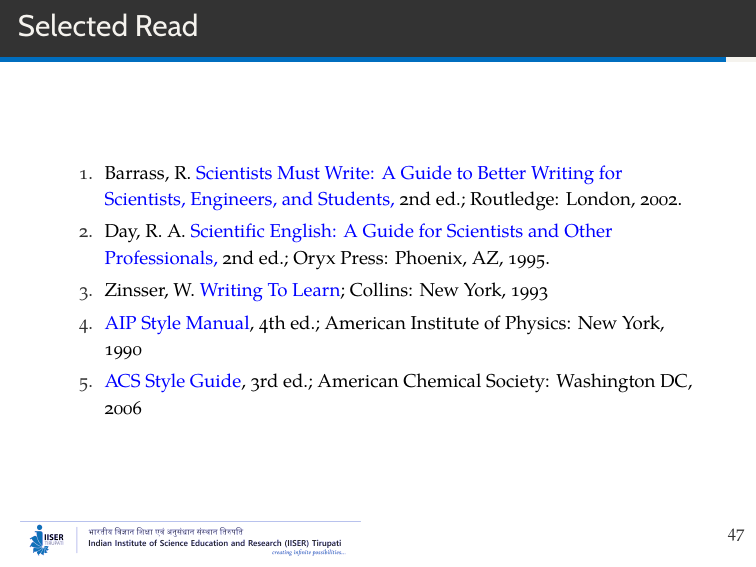

# Methods and Tools for Qualitative Research Writing

**P. A. Praveen**

---

## Slide 1

Thanks for the Nice introduction. Good morning all. So, today I'll discuss on research writing. 

---

## Slide 2

I categorized this talk into four sections. In the first section we'll see some basics of preparing manuscripts. In the second section we can see the formatting rules for a scientific document. Language is an important part in the manuscript preparation and we'll briefly see that in the third portion. Finally I'll list few writing related tools which could be aided for the manuscript preparation in the tools section.

---

## Slide 3

Okay, let's starts with the basics.

---

## Slide 4

Very fundamental and very important aspect in research writing is its ethical concerns. You might have known Newton's famous quote, "Standing on the shoulders of giants" in the home page of Google Scholar. Its a metaphor used by Newton about the significance of galileo's work. What it actually means is, scientific discoveries building over the knowledge of previous discoveries. Its like building castle of cards, and even if one card fails, entire system would collapse. So, fabrication and falsification is a very serious offence and unethical, in any kind of research work.

Further, research is about building a better future. It is so meaningless, to provide a society with partly or hidden works. It won't help any of us. So, always a scientific publication should be complete and should support the advancement of science.

---

## Slide 5

One crucial situation is that, you have finished an experiment and have collected significant data. Now the question is, when and what to publish from that data? Here's the rule of thumb.

Don't rush to publish or don't lame to publish. Just go through the literature and confirm yourself that enough work have done. Make yourself sure the obtained results would give better understanding on known issues or it is indicating the existence of new phenomena.

Sometimes, not intentionally, a description may lack of enough evidence or don't have adequate material to address the problem. In such cases, try to avoid the preparation of short and incomplete manuscripts.

Of course, everyone wish to publish their work. But you should aware that it would take its own time. If a manuscript is rejected for few times or got some critical reviews it doesn't mean that the work is not qualitative enough. Try to address the issues and be ready to improve at the draft at any point.

---

## Slide 6

Always remember this. It is easy to publish a fabricated data. But there's always a possibility that it can be identified in near future. Such a defame would severely affects not only your research career but your entire career.

Also, timeline of a researcher is very important. Depending upon the quality of the publications over time, ones reputations will be determined. Of course, a sum of publication is about quality as well as quantity. We need significant number of publications. But large number of low quality publications will give arise a negative image.

One more thing is people used to publish as chunks. Or with slight modification. If you go through literature you can see similar work from same author has been published in different journals simultaneously. But, now a days these are considered as very serious offense. Even in the last year, eight papers have retracted from Journal of Materials science, a springer own journal, due to this duplication. So be careful about this too.

In fact there is a website called retract watch which provide news about retraction of scientific publication due to several issues. Thats the one way to know, what we shouldn't do.

---

## Slide 7

Then there will be a question that always arise, who can get authorship. Literally, anyone who contributed intellectually deserve an authorship. I have my own rule, like if something can be programmed - thats not worth an authorship. So, routine works like assisting material synthesis and running a code won't enough for an authorship.

And surely extending research facility can't be a contribution. I know, this is heavily practiced by us in Indian context as we are lack of enough research facilities. But still you should now, it is unethical.

So, someone who did major work, like from the problem design to characterization would be designated as the first first author. Usually the guide or coordinator, who suggests or direct a research problem will be designated as corresponding author. All others, depending upon their contribution has to be placed in between them.

---

## Slide 8

But in recent days, journals ask the exact role of listed authors. Since modern research work is more and more interdisciplinary and collaborative, most of the times everyone put forth their best. And, seconding them might hinder their contribution.

So, by explicitly declaring the roles of everyone ensures them they have treated fairly. The roles can be categorized from conceptualization to validation and even to the level of project administration.

---

## Slide 9

One more but an very important issue in scientific research is plagiarism. If a previously published text is cloned or simply copied or even if its remixed it falls under plagiarism. You may aware plagiarism check is mandatory in any scientific publication, even before it reaches the editorial office.

Even using your own words from your previously published text is unethical and it is designated as self-plagiarism.

Recently, UGC made it mandatory to check plagiarism even the thesis at masters level. So plagiarize the text won't be a better idea for a qualitative publication.

---

## Slide 10

Now we will see about the general formatting guidelines for a research text. Scientific publications can be broadly classified into either as book or as journal articles. Most of the rules which we are about to discuss is same for the both the fields. So, lets start with the books.

---

## Slide 11

Research books can be further classified into three major classes. Proceedings are the books based on meetings and conferences. Monographs are often discuss a single topic elaborately. For example often theses can be published as monographs. A handbook is often multi-authored and discuss a field in depth.

---

## Slide 12

The journal articles can be classified into four types. Articles are the usual way to communicate a research work. Even though it is expected to be short and precise there is no page limit for them. Notes covers mostly single significant aspect in a research work. And third one is communications or letters, which are preliminary reports of special significance and urgency. Usually notes and communications are subjected to length restriction. Finally review articles summarizes research advancement over time in particular field. In other words, a review article summarizes the current state of understanding on a topic. It surveys and summarizes the previously published studies, instead of reporting new facts or analysis. While the data is collected from previous publication, the manuscript preparation and its communication is similar to the normal article.

---

## Slide 13

The general structure of any research article is, it should have a problem to address. The researcher should hypothesize a possible solution and most often an experiment or theoretical analysis is carried out to test the hypothesis and based on the collected data conclusion well be derived.

As we are going to see this part in detail in the following slides, lets see few important aspects in a manuscript.

It should have a concise title about a length of two lines. And it should reflect the papers contents and emphasize the research work.

And remember even though we are about to discuss the general structure, every journal have their own formatting guidelines. So after a fair draft its a better idea to format the manuscript according to journal guidelines.

But formatting manuscript each and every time of submission is a pain and time consuming task. Understanding this now most of the journals accept free form manuscripts with certain clear formatting. You even can submit the file as PDF and don't need to submit any production materials. Once your paper has been accepted then you have to format it according to the journal format and have to submit it back.

---

## Slide 14

The image shows the major part of any research publication. It should have a abstract that should briefly state the purpose of the research, its methodology and summary of key findings. Then there is the introduction part, that should discuss the previous attempts and what is unsolved and scope of the current research work and even its limitations.

In the Methods or Materials & Methods part, brief and essential discussion about the procedures used, background data, equations should be discussed.

The data obtained from the previously described methods should be summarized in results part and the corresponding discussion and interpretation should be done here.

Finally in conclusion section, the results in the context of original problem should be presented.

---

## Slide 15

Apart from those major sections the manuscript should have the following sections.

In reference section, proper attribution of research works published early should be provided. In referencing there were two aspects. One is to cite the recent works -- which themselves cite an original or important work. In this way the problem look very recent. Mostly now a days journals are recommending this. Because citing a 50 year/ 100 year old publications won't contribute their impact factor. But many scientists against this proposal. I would suggest cite use what you have actually refereed for manuscript writing and in case if you're requested to cite a recent material may be you can adopt that one.

In acknowledgements, People who have assisted our research work like person who read our manuscript and offered his perspective or a friend who might have supplied you some chemicals when you're in need should be acknowledged.

Also, it is not possible to present each and every data that we obtained in a results and discussion section. That might not important in the view of present discussion but might have significant value for a seasoned researcher. Such data can be given as supporting files. Usually it could be a word file but recent days iphython notebooks are widely used as supporting files.

So the general rule of thumb, is since most of the research work done is based on common people money we scientist should responsible for that. Only if a research work is completely disclosed it would be useful for the future advancement of the field.

---

## Slide 16

Lets move on to the language part. Here I assume that we all are going to use English as the communication language. Even if you're writing in other language the scientific descriptions could be the same.

---

## Slide 17

In a manuscript, always use short and declarative sentences. Your statements should look like a fact rather than poetry which may arise a lot of questions. Sentences should be straight forward and should be easy to read. Use love for books instead of bibliophilic. I doesn't mean you have a translate each and every scientific word, but try to be simple.

---

## Slide 18

Scientist don't need to be an expert in language or in grammar. But it is important that our sentences should not confuse others. Its good to publish a paper on encryption. But it shouldn't be your paper itself encrypted. Considering tenses and voices,

* use active voice when its less wordy
* use passive voice when the doer is not important. Like the samples were annealed at 200 deg C.
* For describe what was done use simple past and to describe facts use present tense
* Most of the paper written in the combination of simple present and simple past tense. Both are fine to discuss the results and conclusion part.
* finally, use first person when it helps to keep you meaning and express purpose or decision

---

## Slide 19

Scientific language like doing a math problem. There's no space for jargon and excessive words. Of course reverse is also true. But always try to be brief. Omit empty phrases. Omit excess words. Importantly don't give too much exaggeration to the work. Even now a days journals advising researchers to avoid the word novel in their manuscript. For example if people synthesizing 1000 new materials in a year and every one designate their material as novel, the word itself looses its meaning. Finally, not only in your life, in your manuscript too, you should be economical. Spend for necessary things but always save for the future.

---

## Slide 20

An important aspect in language usage is to use gender neutral language. Like any fields, in science also women are restricted to enter. So, earlier texts contains words that directly indicating men. With advancement of societies, women are no longer any par below and their contribution are any less. So, it is advised to use gender neutral language in our research texts.

---

## Slide 21

### Brackets

* **incorrect**  
where V is volume and (V) is volume at equilibrium  
* **correct**   
where V is volume and $V_e$ is volume at equilibrium

### Italic

* $C_p$ for heat capacity at constant pressure  
* $C_B$ for heat capacity of substance B

**Exponents:** $T_{2m}^{~~~~-1}$   
**Slash:** $t_{1/2}$  
**Space:** $E^{(350nm)}$

---

## Slide 22

As shown in slide

---

## Slide 23

As shown in slide

---

## Slide 24

As shown in slide

---

## Slide 25

**Examples:**

1. $\beta$,4-dichlorocyclohexanepropionic acid

Others as in slide

---

## Slide 26

As shown in slide

---

## Slide 27

As shown in slide

---

## Slide 28

When comes presenting data, there would be always an confusion like, whether I should present this a graph or as table? The rule of thumb is, if you want to convey the points at a glance or want to show the trends or relationship between different parameters, graph is preferable.

For example if you record a UV absorption spectrum which has characteristic absorption peak or peaks its better to mention it in the text itself. On the other hand, you want to show the variation in absorption spectrum with respect to different environments its better to use a graph.

Consider graph when you want disclose the exact numbers. For example instead of showing an AFM image it is better to list different physical parameters obtained from that studies like roughness, skewness etc.

---

## Slide 29

1 & 2 as in slide   
For example variation of mobility with respect to different temperature.  
 following as in slide

---

## Slide 30

AIS

---

## Slide 31

AIS

---

## Slide 32

AIS

---

## Slide 33

Sometimes you may need to use figures or tables or some other material from the previous publications. Unless explicitly declared all the scientific contents are copyright protected. Once your manuscript has been accepted for publication, the published would ask you to provide a copyright transfer form. It means all the copyright of the text has been transferred to the publisher. After this even for use your own figures and tables you have to get proper permission from the publishers. So open access journals like Nature Communications or RSC Advances, charge you an amount and will publish the manuscript as open or in creative common license. Open means people can freely access the manuscript and CC includes many terms that includes anyone can use any thing without any permission. In all the cases proper attribution is required.

One thing I want to mention here. Sometime people download an image from internet and cite it as from google. It is like you get some article from google search and cite it like from google. We should find the actual source of the image and that should be cited.

---

## Slide 34

Now let us move on to the tools part. Research writing requires different tools for writing to graphing and other related works. Here I summarize few tools which I have either used or tested. Since science is very broad area and there were numerous inter disciplinary based softwares one may not know each and every tool. So here I provided a generalized version.

---

## Slide 35

---

## Slide 36

But not suitable for big documents like thesis and vc

---

## Slide 37

AIS

---

## Slide 38

AIS

---

## Slide 39

KST for astronomical data

---

## Slide 40

Numerical computing
Computer algebra system

---

## Slide 41

---

## Slide 42

---

## Slide 43

---

## Slide 44

Scite.ai

---

## Slide 45

---

## Slide 46

So here's the take home message.

---

## Slide 47

* Be sure your work is ethical and you followed all standard guidelines
* Publish when you feel the work is complete - not publish for credits alone.
* One better way is internal circulation among peers or seniors and ask their comments
* Make sure proper language and formatting rules are applied to your manuscript.
* Again the better way is ask a friend or senior colleague for comments. If possible you can contact the language department experts.
* And if you're rich enough can go for journals language assistance option
* Regarding tools, I would suggest you to consider open-source. After all science doing science is mostly non-profit, usage of tools may also be. Modern open source tools are equivalent and in some cases much better than the commercial tools. Take GIMP or InkScape, I personally feel they are much better than Photoshop or illustrator. But its up to you. People often go for pro version due to the reason they're available as pirated version. This might also create some issue in feature. More and more softwares are network oriented, it is easy to detect a pirated copy. Then you're supposed to buy one or have to adopt a open source software which includes a learning curve. But its all up to you. The soldier chose his own weapon.

---

## Slide 48

---

## Slide 49

At the end of the day I wish to express my sincere gratitude to some my friends and colleague who always supporting me and especially supported me by lending their expertise to make this talk possible.

I thank, 

*Slide*

---

## Slide 50

Finally thank you all for your participation. Please write to me if you have some suggestions or questions. Thanks again.
